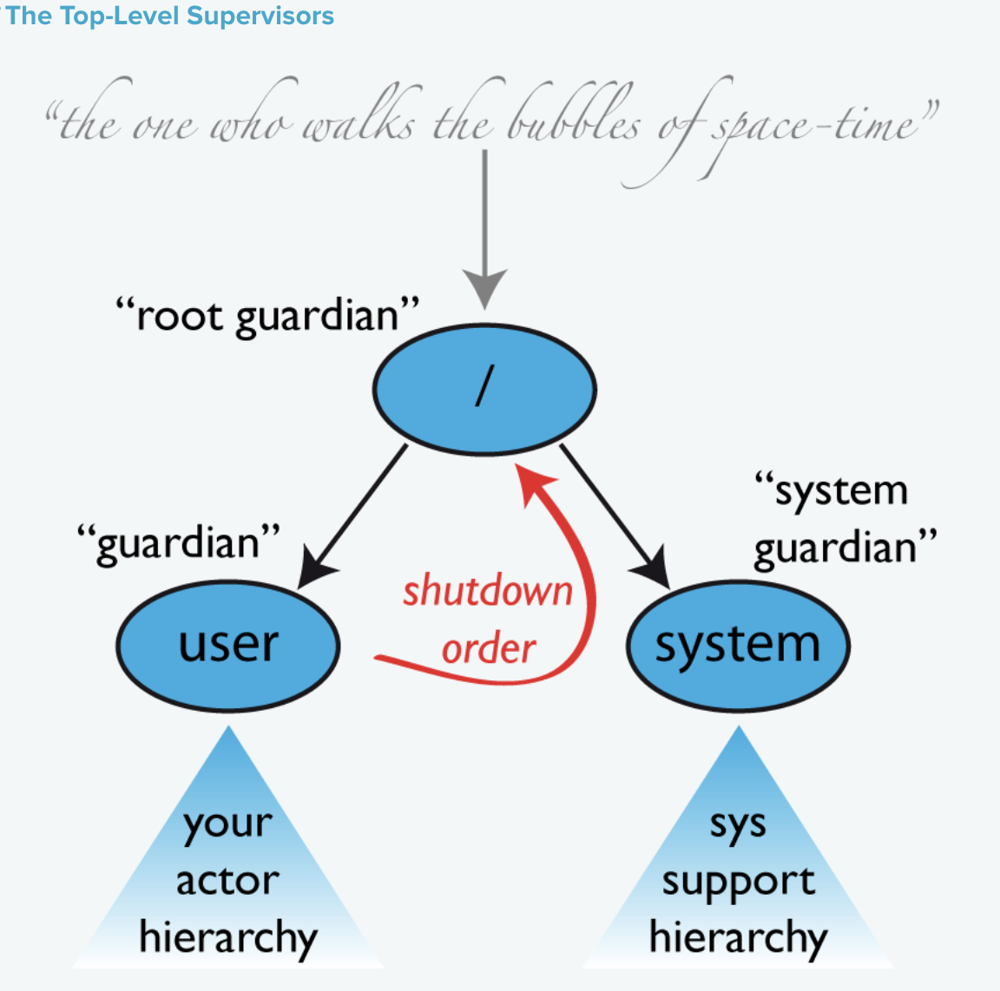

* 目录
{:toc}

### 监督是什么意思

Actor系统监督描述了actor之间的依赖关系：主管将任务委托给下属，因此必须对他们的失败做出反应。
当下属检测到故障(即抛出异常)时，它会挂起自己和它的所有下属，并向其主管发送消息，发出故障信号。根据所监督工作的性质和失败的性质，主管可选择以下四种选择：

* 恢复下属，保持其累积的内部状态
* 重新启动下属，清除其累积的内部状态
* 永久停止下属
* 使失败升级，从而使自身失败

必须始终将actor视为监督体系的一部分，这说明了第四种选择的存在(作为上级主管也从属于另一位主管)，并对前三种情况有影响：恢复一名actor会恢复其所有下属，
重新启动一名actor意味着重新启动其所有下属，同样，终止一名actor也将终止其所有下属。
应该注意的是，Actor类的preRestart钩子的默认行为是在重新启动之前终止它的所有子类，但是这个挂钩可以被重写；递归重新启动适用于执行这个钩子之后留下的所有子程序。

每个监控器都配置了一个函数，将所有可能的故障原因(即异常)转换为上述四种选择之一；
值得注意的是，此函数不接受失败的actor的身份作为输入。很容易想出这样做可能是不够灵活的，例如希望对不同的下属actor采用不同的战略。
在这一点上，理解监督是对于递归的故障处理结构是至关重要的。如果您试图在一个级别上做太多事情，就很难进行推理，因此在这种情况下推荐的方法是添加一个级别的监督。

Akka实施了一种称为“父母监督”的特定形式。actor只能由其他actor创建(其中，顶级actor由库提供，并且每个创建的actor都由其父程序进行监督。)
这种限制使得actor监督等级的形成隐含并鼓励合理的设计决策。应该指出的是，这也保证了行为者不可能成为孤儿，也不会被外部的监督者所依附，否则他们可能会不知不觉地被抓到。
此外，这将为actor应用程序(子树)提供一个自然而干净的关闭过程。

    注意：监控相关的父-子通信发生在特殊的系统消息中，这些邮件有自己的邮箱，与用户消息分开。
    这意味着，相对于普通消息，与监督相关的事件并不具有决定性的有序性。通常，用户不能影响正常消息和失败通知的顺序。



一个actor系统将在其创建期间至少启动三个actor，如上图所示。

### 高级监督actor

`/user: The Guardian Actor`

与之交互最多的actor可能是所有用户创建的actor的父级actor，即名为“/user”的监护人。
使用system.actorOf()创建的actor是此actor的子actor。这意味着当该监护人终止时，系统中的所有正常actor也将被关闭。
这也意味着这位监护人的监管策略决定了高层正常actor是如何受到监督的。由于Akka 2.1可以使用`akka.actor.guardian-supervisor-strategy`配置它，
该策略采用了SupervisorStrategyConfigurator的完全限定类名。当监护人升级失败时，根监护人的反应将是终止监护人，这实际上将关闭整个actor系统。

`/system: The System Guardian`

这个特殊的监护人被引入是为了实现一个有序的关闭序列，其中日志记录保持活跃，而所有正常的actor终止，即使日志本身是使用actor实现的。
这是通过让系统监护人监视用户监护人并在接收到终止的消息时启动自己的关闭来实现的。顶级系统actor使用一种策略进行监督，该策略将对所有类型的异常无限期地重新启动，但ActorInitializationException和ActorKilledException除外，这将终止所讨论的子异常。
所有其他可抛出的都会升级，并将关闭整个actor系统。

`/: The Root Guardian`

根actor是所有所谓的“顶级”actor的祖父母，并使用`SupervisorStrategy.stoppingStrategy`监督策略来监督“顶层Scopes的actor path”中提到的所有特殊actor，其目的是在任何类型的例外情况下终止孩子。
所有其他可移植对象都将升级为…。但是对谁呢？因为每个真正的actor都有一个监督者，所以根监护人的监督者不可能是真正的actor。
因为这意味着它是“泡沫之外的”，它被称为“泡沫行者”。这是一个合成ActorRef，它实际上是在第一个故障迹象出现时停止其子actor，并在根监护人完全终止时将actor系统的isTerminated状态设置为true(所有子节点递归停止)。

在路径层次结构的根目录下，位于根监护人的位置上，可以找到所有其他actor；它的名称是"/"，下一个级别包括以下内容：

顶层Scopes的actor path

* "/user"是所有用户创建的顶级actor的监护人；使用ActorSystem.actorOf这个找到的
* "/system"是所有系统创建的顶级actor的守护者，例如，记录侦听器或在actor系统启动时通过配置自动部署的actor。
* "/deadLetters"是死信actor，在这里，发送给已停止或不存在的actor的所有消息都会被重新路由(在尽最大努力的基础上：消息甚至可能在本地JVM中丢失)。
* "/temp"是所有短暂的系统创建的actor的监护人，例如那些用于实现ActorRef.ask.
* "/remote"是一种人为的路径，下面所有actor的监事都是远程actor的引用。

### 监督策略

Akka有两类监督策略：OneForOneStrategy和AllForOneStrategy。这两种方法都配置了一个从异常类型到监督指令的映射，并限制了在终止它之前允许子程序失败的频率。
它们之间的区别是前者只对失败的子actor应用所获得的命令，而后者也将其应用于所有兄弟姐妹actor(同层的)。通常，您应该使用OneForOneStrategy，如果没有显式指定，这也是默认的。

AllForOneStrategy适用于以下情况：儿童群体之间有非常紧密的依赖关系，一个孩子的失败将影响到其他儿童的功能，即他们之间有着不可分割的联系。
由于重新启动不会清除邮箱，所以通常最好是在失败时终止子节点，并从主管那里显式地重新创建它们(通过监视子程序的生命周期)；否则，
您必须确保任何actor能接收到重新启动之前排队的消息且随后处理都没有问题。

通常，使用“全对一”策略时，停止一个子程序(即不响应失败)不会自动终止其他子级的；这可以通过观察它们的生命周期来完成：如果终止的消息没有由主管处理，
它将抛出DeathPactException，该异常(取决于其主管)将重新启动它，默认的preRestart操作将终止所有的子级。当然，这也可以显式地处理。

注意，从“一对一”管理者创建一次性actor意味着临时actor升级的失败将影响所有永久actor。如果不需要，请安装一个中间管理器；这可以通过为工作进程声明一个大小为1的路由器来完成。

### 使用生命周期监控

简单退避：

以下Scala片段展示了如何创建退避监控器，该监控器将在由于故障而停止运行后启动给定的回波器，间隔时间为3、6、12、24，最后是30秒：

```scala
val childProps = Props(classOf[EchoActor])

val supervisor = BackoffSupervisor.props(
  BackoffOpts.onStop(
    childProps,
    childName = "myEcho",
    minBackoff = 3.seconds,
    maxBackoff = 30.seconds,
    randomFactor = 0.2 // adds 20% "noise" to vary the intervals slightly
  ))

system.actorOf(supervisor, name = "echoSupervisor")
```

下面的Scala片段展示了如何创建退避监控器，它将在由于某些异常而崩溃后启动给定的回波处理器，增加间隔3、6、12、24，最后30秒：

```scala
val childProps = Props(classOf[EchoActor])

val supervisor = BackoffSupervisor.props(
  BackoffOpts.onFailure(
    childProps,
    childName = "myEcho",
    minBackoff = 3.seconds,
    maxBackoff = 30.seconds,
    randomFactor = 0.2 // adds 20% "noise" to vary the intervals slightly
  ))

system.actorOf(supervisor, name = "echoSupervisor")
```

只适用于BackoffOnStopoptions：

* *withDefaultStoppingStrategy：设置一个OneForOneStrategy和停止决定器，在所有异常情况下停止子进程。
* *withFinalStopMessage：允许定义一个谓词来决定最终停止子actor(和主管)。

```scala
val supervisor = BackoffSupervisor.props(
  BackoffOpts
    .onStop(
      childProps,
      childName = "myEcho",
      minBackoff = 3.seconds,
      maxBackoff = 30.seconds,
      randomFactor = 0.2 // adds 20% "noise" to vary the intervals slightly
    )
    .withManualReset // 子级必须发送backoffsupervisor.reset到其父级
    .withDefaultStoppingStrategy // 在引发任何异常时停止
)
```

上面的代码设置了一个备用监控器，它要求子actor在成功处理邮件时向其父节点发送akka.pattern.backoffSupervisor.Reset消息，并重置回退。
它还使用默认的停止策略，任何异常都会导致子程序停止。

```scala
val supervisor = BackoffSupervisor.props(
  BackoffOpts
    .onFailure(
      childProps,
      childName = "myEcho",
      minBackoff = 3.seconds,
      maxBackoff = 30.seconds,
      randomFactor = 0.2
    )
    .withAutoReset(10.seconds)
    .withSupervisorStrategy(OneForOneStrategy() {
      case _: MyException => SupervisorStrategy.Restart
      case _              => SupervisorStrategy.Escalate
    }))
```

上面的代码设置了一个备用监控器，如果抛出MyException，任何其他异常都会升级。如果子程序在10秒内没有抛出任何错误，则自动重置回退。

[文档](https://doc.akka.io/docs/akka/current/general/supervision.html)