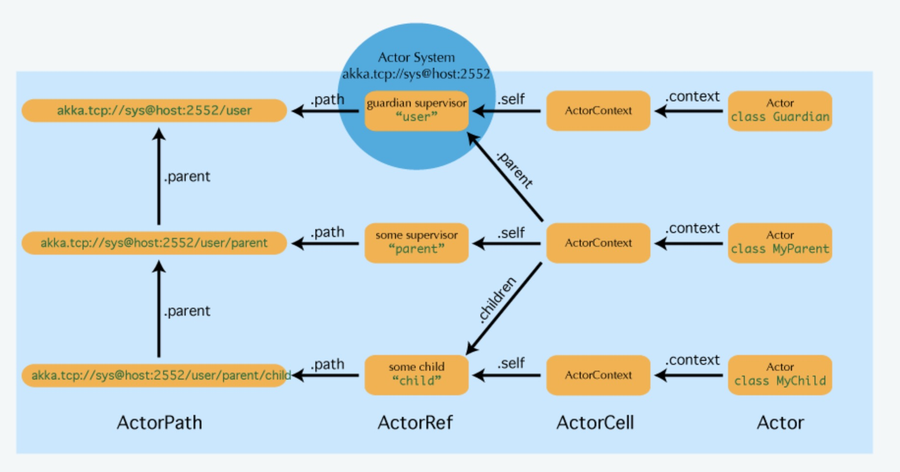
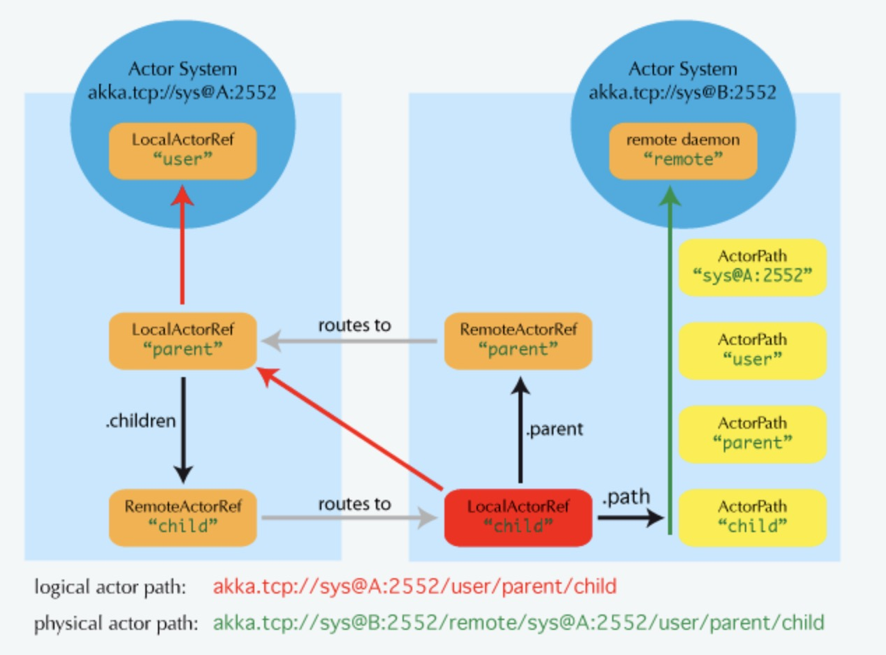

* 目录
{:toc}



上面的图片显示了actor系统中最重要的实体之间的关系，请阅读详细信息。

### 什么是actor的引用

actor引用是ActorRef的子类型，其首要目的是支持向它表示的actor发送消息。每个actor都可以通过自身字段访问其规范的(本地)引用。默认情况下，此引用存在于发送给其他actor的所有消息的发件人引用中。相反，在消息处理期间，actor可以通过sender()方法访问表示当前消息的发送者的引用。

根据actor系统的配置，支持几种不同类型的actor引用：

* 纯本地actor引用被未配置为支持网络功能的actor系统使用。如果通过网络连接发送到远程JVM，这些actor引用将无法工作。
* 启用远程处理后的本地actor引用由actor系统使用，这些actor系统支持那些表示同一JVM中的actor的引用的联网功能。为了在发送到其他网络节点时也是可以联系的，这些引用包括协议和远程寻址信息。
* 有一个本地actor引用的子类型用于路由器(即，在Router trait中混合的actor)。它的逻辑结构与上述本地引用的逻辑结构相同，但是向他们发送消息会直接分派给他们的一个孩子。
* 远程actor引用表示可以使用远程通信访问的actor，即向它们发送消息将透明地序列化消息并发送给远程JVM。
* 在所有实际目的中，有几种特殊类型的actor引用与本地actor引用类似：

      1. PromiseActorRef是Promise的特殊表示形式，目的是通过actor的响应来完成。 akka.pattern.ask创建此actor 引用。
      2. DeadLetterActorRef是死信服务的默认实现，Akka将所有目的地已关闭或不存在的消息路由到死信服务。
      3. Akka在查找不存在的本地actor路径时返回的是EmptyLocalActorRef：它等效于DeadLetterActorRef，但它保留其路径，以便Akka可以通过网络发送该路径并将其与该路径的其他现有actor引用进行比较，其中可能是在actor去死亡之前获得的。
* 还有一些一次性的内部实现，您永远不应该看到：

       1. 有一个actor引用，它并不代表一个actor，而只是作为根守护者的伪监督者，我们称它为“在时空泡泡中行走的人”。原文是“the one who walks the bubbles of space-time”
       2. 在实际启动actor创建设施之前启动的第一个日志记录服务是一个伪造的actor引用，它接受日志事件并将其直接打印到标准输出中。它是Logging.StandardOutLogger。

### 什么是actor的路径

由于actor是按照严格的分层方式创建的，通过递归地遵循子和父级之间的监督链接，直到actor系统的根节点，存在一个唯一的actor名称序列。
可以将这个序列看作是文件系统中的文件夹，因此尽管actor层次结构与文件系统层次结构有一些根本的区别，但是我们还是采用“路径”这个名称来引用它。这里是指用户actor系统到顶层根actor之间的多叉树路径。

一个actor路径由一个锚点组成，锚点标识actor系统，然后将路径元素连接起来，从根监护器连接到指定的actor；路径值是被遍历的actor的名称，并由斜线分隔。

#### actor引用和路径有什么区别

actor引用指定单个actor，引用的生命周期与该actor的生命周期相匹配；一个actor路径代表一个名称，该名称可能由actor占用也可能没有，并且该路径本身没有生命周期，因此永远不会无效。
您可以在不创建actor的情况下创建actor路径，但是在不创建相应actor的情况下不能创建actor引用。

您可以创建一个actor，终止它，然后使用相同的actor路径创建一个新的actor。新创造的actor是旧actor的新化身而不是同一个actor。
actor对旧化身的引用对于新的化身是无效的。发送给旧的actor引用的消息将不会传递给新的化身，即使它们有相同的路径。

#### actor路径锚点

每个actor路径都有一个地址组成，描述了相应actor所能到达的协议和位置，并从头开始跟随层次结构中actor的名称。例如：

```scala
"akka://my-sys/user/service-a/worker1"                   // purely local
"akka.tcp://my-sys@host.example.com:5678/user/service-b" // remote
```
在这里，akka.tcp是2.4版本的默认远程传输工具。其他的传输工具是可插拔的。主机和端口部分的说明(即示例中的host.example.com:5678)取决于所使用的传输机制，但必须遵守URI结构规则。

#### actor的逻辑路径

通过将家长监督链接指向根监护人而获得的唯一路径称为actor的逻辑路径。该路径与actor的创建祖先完全匹配，因此，一旦设置了actor系统的远程配置(以及路径的地址部分)，它就完全具有确定性。

#### actor的物理路径

当actor的逻辑路径描述一个actor系统中的功能位置时，基于配置的远程部署意味着一个actor可以创建在与其父节点不同的网络主机上，即在不同的actor系统中。在这种情况下，遵循根守护者的actor路径需要遍历网络，这是一项代价高昂的操作。
因此，每个actor也有一个物理路径，从实际actor对象所在的actor系统的根监护人开始(如下面小节"与远程部署的交互"的图所示)。当查询其他actor时，使用此路径作为发送者引用将允许他们直接回复该actor，从而最小化路由所引起的延迟。

一个重要的方面是，actor的物理路径从不跨越多个actor系统或JVM。这意味着，如果某个actor的祖先之一受到远程监视，则其逻辑路径(监督层次结构)和物理路径(actor远程部署)可能会发生分歧。

#### actor路径别名或符号链接

在一些真正的文件系统中，您可能会想到一个actor的“路径别名”或“符号链接”，也就是说，一个actor可以使用多条路径到达。
但是，您应该注意到，actor层次结构与文件系统层次结构不同。您不能像符号链接那样自由地创建actor路径来引用任意的actor。
正如上面的actor逻辑路径和物理路径部分所描述的那样，actor路径必须是表示监视层次结构中的逻辑路径，或者是代表actor远程部署的物理路径。

### 如何获得actor的引用

关于如何获得角色引用的方法，大致分为两类：通过创建actor或查找actor，后者的功能包括从具体actor路径创建actor引用和查询逻辑的actor层次结构中的引用这两种形式。

#### 创建actor树

通常，通过使用ActorSystem.actorOf方法在监护actor下创建actor，然后从创建的actor中使用ActorContext.actorOf来启动actor系统，以生成actor树结构。这些方法返回对新创建的actor的引用。
每个actor都可以直接访问(通过其ActorContext)其父代，自身和子代的引用。这些引用可以在消息内发送给其他actor，从而使他们能够直接回复消息。

#### 通过具体路径查找actor

此外，可以使用ActorSystem.actorSelection方法查找actor引用。该选择可以用于与所述actor进行通信，并且在传递每个消息时查找与该选择相对应的actor。
要获取绑定到特定actor生命周期的ActorRef，您需要向actor发送消息(例如内置的Identify消息)，并使用接收者actor回复的sender()引用。

#### 绝对路径与相对路径

除ActorSystem.actorSelection外，还有ActorContext.actorSelection，可在任何actor中将其作为context.actorSelection使用。
这样就产生了一个actor的选择，非常类似于在ActorSystem上的双胞胎，但是它不是从actor树的根开始查找路径，而是从当前actor开始。
由两个点(“ ..”)组成的路径元素可用于访问父actor。例如，您可以向特定的兄弟姐妹发送消息：

```scala
context.actorSelection("../brother") ! msg
```

也可以以通常的方式在上下文中查找绝对路径，即

```scala
context.actorSelection("/user/serviceA") ! msg
```
他们具有相同效果，很好的工作。

#### 查询逻辑的actor层次结构

由于actor系统形成了类似层次结构的文件系统，所以路径匹配与Unix Shell所支持的方式是一样的：您可以用通配符(*和？)替换路径元素名称(*和？)，以形成可能匹配零或多个实际actor的选择。
因为结果不是单个actor引用，所以它有一个不同类型的ActorSelection，并且不支持ActorRef所做的全部操作集。
可以使用ActorSystem.actorSelection和ActorContext.actorSelection方法来制定选择，并支持发送消息：

```scala
context.actorSelection("../*") ! msg
```

将向包括当前actor在内的所有兄弟姐妹发送msg。对于使用ActorSelection获得的引用，要执行消息发送，需要遍历监督层次结构。
由于匹配所选内容的actor的确切集合可能会发生变化，甚至在消息发送给收件人时也可能发生变化，因此在活跃变化时不可能查看所选内容的确切内容。
为了做到这一点，通过发送请求和收集所有答案，提取发件人引用，然后观察所有发现的具体actor，来解决不确定性。这种解决选择的方案可以在将来的发行版中加以改进。

总结：actorOf与actorSelection

actorOf只会创建一个新的actor，并将其作为调用此方法的上下文的直接子代(可以是任何actor或actor系统)。
actorSelection仅在传递消息时查找现有的actor，即不创建actor，或在创建选择时验证actor的存在

### actor引用与路径相等性

ActorRef的相等性与ActorRef对应于目标actor化身的意图相匹配。当两个actor引用具有相同的路径并指向相同的actor化身时，比较它们时是相等的。
指向终止的actor的引用不等于指向具有相同路径的另一个(重新创建的)actor的引用。
请注意，由于故障导致的actor重新启动仍然意味着它是同一actor的化身，即ActorRef的使用者看不到重新启动。

如果需要跟踪集合中的actor引用，而不关心确切的actor化身，则可以使用ActorPath作为键，因为在比较actor路径时不会考虑目标actor的标识符。
从这也可以看出，实际上路径(path)是actor的名称，后面跟着的是actor的唯一标识符id，大多数情况下可以忽略这个id的存在。如下：

```
First: Actor[akka://testSystem/user/first-actor#1053618476] //akka是协议，表示是本地actor

Second: Actor[akka://testSystem/user/first-actor/second-actor#-1544706041] //second-actor是first-actor的孩子，1544706041是id
```

### 重用actor路径

当actor终止时，它的引用将指向死信邮箱，DeathWatch将发布其最终过渡，并且通常不希望它再次出现(因为actor的生命周期不允许这样做)。
尽管以后可以使用相同的路径创建一个actor(由于在不保持所有创建的actor可用的情况下就不可能强制执行相反的操作)是一种不好的做法：
通过actorSelection发送给actor的消息“死亡”的人突然又开始工作了，但是并没有保证在此过渡和任何其他事件之间顺序，因此，该路径的新居民可能会收到发往前一个租户的消息。

在非常特殊的情况下这样做可能是正确的，但是请确保将其处理仅限于actor的上司(主管)，因为这是唯一能够可靠地检测到正确注销的actor的名称，在此之前，新子女的创建将失败。

在测试期间，当测试主题依赖于在特定路径上实例化时，它也可能是必需的。在这种情况下，最好是模拟其主管，以便它将终止的消息转发到测试过程中的适当点，使后者能够等待名称的正确注销。

### 与远程部署的交互

当actor创建子actor时，actor系统的部署程序将决定新actor是驻留在同一个JVM中，还是驻留在另一个节点上。在第二种情况下，
将通过网络连接来触发actor的创建，这种连接发生在不同的JVM中，因此也会发生在不同的actor系统中。远程系统将将新actor置于为此目的保留的特殊路径之下，
而新actor的主管将是远程actor的引用(代表触发其创建的该actor)。在这种情况下，context.parent(主管引用)和context.path.parent(actor路径中的父节点)并不表示相同的actor。
但是，在监控程序中查找子节点的名称会在远程节点上找到，从而保持逻辑结构，例如，当发送到未解析到的actor引用时。



### 地址部分是用来做什么的

当通过网络发送actor引用时，它由其路径表示。因此，路径必须对向底层actor发送消息所需的所有信息进行完全编码。
这是通过在路径字符串的地址部分编码协议、主机和端口来实现的。
当actor系统从远程节点接收到actor路径时，它会检查该路径的地址是否与该actor系统的地址匹配，在这种情况下，它将被解析为actor的本地引用。否则，它将表示远程actor引用。
远程的actor只有最前面含有akka.tcp，后面的会自带协议。
    
### 顶层Scopes的actor路径

参考(Actor的监督与检测 - 高级监督actor)。

[文档](https://doc.akka.io/docs/akka/current/general/addressing.html)

* 使用搜狗翻译、百度翻译、谷歌翻译，仅供参考
* 来自官方文档、参考《响应式架构 消息模式Actor实现与Scala、Akka应用集成》
* 后续随着理解深入会继续修改错误和描述，以便更好理解，本博客开源，欢迎指出错误