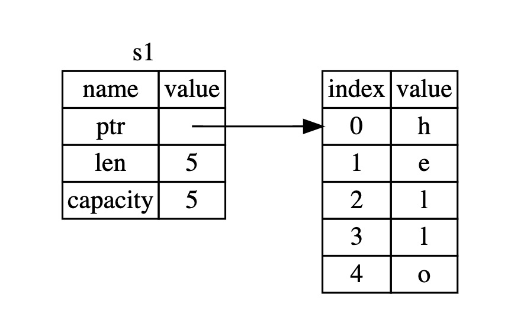
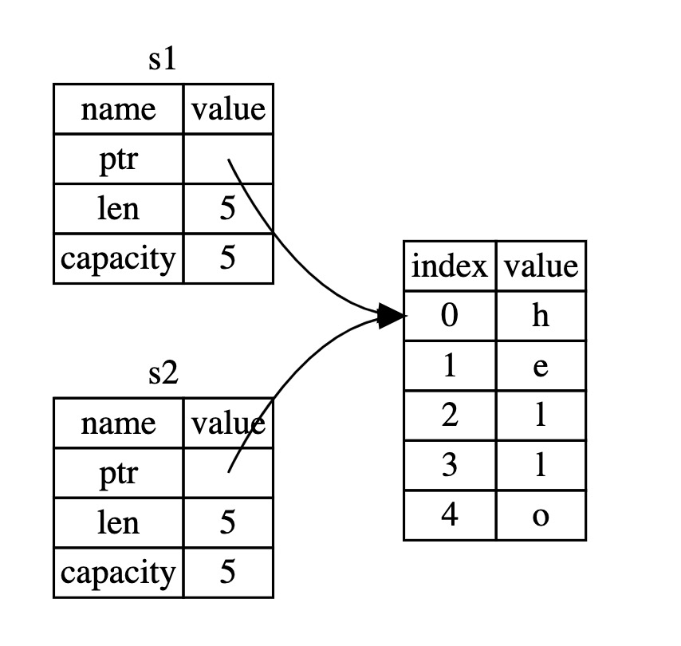
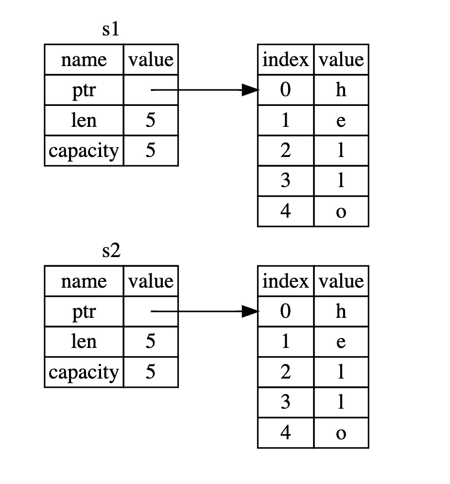
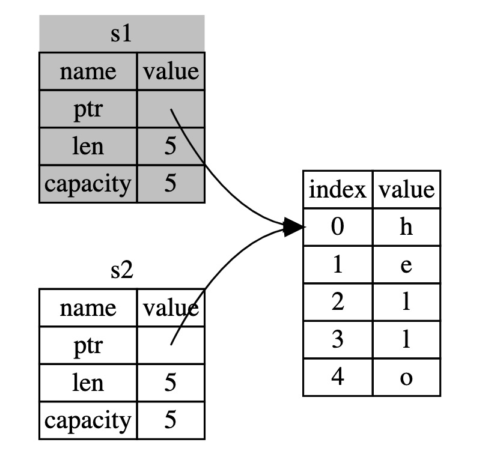

* 目录
{:toc}

# 什么是所有权

Rust的主要特征是所有权。尽管该功能易于解释，但对其余语言有深远的影响。

所有程序必须在运行时管理它们使用计算机内存的方式。某些语言具有垃圾回收功能（Java、Scala），该垃圾回收功能会在程序运行时不断寻找不再使用的内存。在其他语言中，程序员必须显式分配和释放内存（C、C++）。 
Rust使用第三种方法：通过所有权系统管理内存，该系统具有一组在编译时检查的规则。程序运行时，所有所有权功能都不会减慢其运行速度。

## Rust 堆与栈（栈也称为堆栈）

在许多编程语言中，您不必经常考虑堆栈和堆。但是在像Rust这样的系统编程语言中，值是在堆栈上还是在堆上对语言的行为以及为什么必须做出某些决定具有更大的影响。所有权的各个部分将在本章后面的堆栈和堆中进行介绍，因此这里是准备工作的简要说明。

堆栈和堆都是内存的一部分，您的代码可在运行时使用，但是它们的结构不同。堆栈具有后进先出的特性。与队列相反。（队列是先进先出）

堆栈中存储的所有数据必须具有已知的固定大小。编译时大小未知或大小可能更改的数据必须存储在堆中。堆的组织性较差：将数据放在堆上时，您需要一定数量的空间。操作系统在堆中找到一个足够大的空闲空间，将其标记为正在使用中，然后返回一个指针，该指针是该位置的地址。此过程称为在堆上分配，有时也简称为分配。将值压入堆栈不被视为分配。
由于指针的大小是已知固定的，因此可以将指针存储在堆栈上，但是当需要实际数据时，必须跟随指针。即必须使用指针获取这些数据。

推送到堆栈比在堆上分配要快，因为操作系统无需搜索存储新数据的位置。该位置始终位于堆栈的顶部。相比之下，在堆上分配空间需要更多的工作，因为操作系统必须首先找到足够大的空间来容纳数据，然后执行簿记以准备下一次分配。（记录内存使用情况，更详细的可以参操作系统的内存分配部分）

访问堆中的数据比访问堆栈中的数据要慢，因为您必须跟随指针才能到达那里。如果现代处理器在内存中的跳动较少（我理解是寻址的次数少），则速度会更快。如果处理器可以处理与其他数据接近（如堆栈中）而不是更远（如堆上）的数据，则可以更好地完成工作。在堆上分配大量空间也可能需要时间。

当您的代码调用函数时，传递给函数的值（可能包括指向堆上数据的指针）和函数的局部变量将被压入堆栈。函数结束后，这些值将从堆栈中弹出。

跟踪代码的哪些部分正在使用堆上的哪些数据，最大程度地减少堆上的重复数据量以及清理堆上的未使用数据以确保空间不会耗尽都是所有权解决的所有问题。了解所有权后，您就不需要经常考虑堆栈和堆了，但是知道管理堆数据是所有权存在的原因，可以帮助您解释其工作原理。

## 所有权规则

首先，让我们看一下所有权规则。在通过示例进行说明时，请牢记以下规则：

* Rust中的每个值都有一个变量，称为其所有者。
* 一次只能有一个所有者。
* 当所有者超出范围时，该值将被删除。

## 变量范围

作为所有权的第一个示例，我们将研究一些变量的范围。范围是程序中项目有效的范围。假设我们有一个看起来像这样的变量

```rust
let s = "hello";
```

变量s表示字符串文字，其中字符串的值被硬编码到程序的文本中。该变量从声明之点到当前作用域结束为止一直有效。

```rust
{                      // s 无效，还没有被定义
    let s = "hello";   // 从现在开始，s是有效的

    // 用s处理一些事情
}  // 此作用域已经结束，并且s不再有效
```

换句话说，这里有两个重要的时间点：

* 当s进入范围时，它是有效的。
* 它保持有效，直到超出范围。

此时，作用域之间以及变量有效时的关系类似于其他编程语言中的关系。现在，我们将通过在此理解之上介绍String类型。

## String 类型

为了说明所有权规则，我们需要一个更复杂的数据类型。先前介绍的类型都存储在堆栈中，并在其作用域结束时从堆栈中弹出。但是我们想查看存储在堆上的数据，并探索Rust如何知道何时清理该数据。

在这里以String为例，重点介绍与所有权相关的String部分。这些方面也适用于其他复杂数据类型，无论它们是由标准库提供还是由自己创建的。

我们已经看到了字符串文字，其中字符串值被硬编码到我们的程序中。字符串文字很方便，但并不适合我们可能要使用文字的所有情况。原因之一是它们是不可变的。
另一个是在编写代码时并不是每个字符串值都是已知的：例如，如果我们想接受用户输入并存储它，该怎么办？对于这些情况，Rust具有第二个字符串类型String。此类型分配在堆上，因此能够存储在编译时我们不知道的大量文本。您可以使用from函数从字符串文字创建字符串，如下所示：

```rust
let s = String::from("hello");
```

双冒号（::）是一个运算符，它使我们可以在String类型下的函数中对该特殊名称进行命名空间，而不必使用诸如string_from之类的名称.

这种字符串可以被改变：

```rust
let mut s = String::from("hello");

s.push_str(", world!"); // push_str() 将文字附加到字符串，必须使用mut，否则s不可变！

println!("{}", s); //打印 hello, world!
```

所以，这里有什么区别？为什么可以对String进行改变而不能对文字（指let s = "hello"这种直接声明的字符串常量）进行改变？区别在于这两种类型如何处理内存。在Java中对应就是字符串常量与字符串对象的区别。

## 内存和分配

对于字符串文字，我们在编译时就知道内容，因此文本直接硬编码到最终的可执行文件中。这就是为什么字符串文字快速高效的原因。但是这些属性仅来自字符串文字的不变性。不幸的是，对于在编译时未知大小且在运行程序时大小可能会改变的每段文本，我们无法在二进制文件中添加一点内存（形容无法做到）。

对于String类型，为了支持可变的，可增长的文本，我们需要在堆上分配一定数量的内存（在编译时未知）来容纳内容。这表示：

* 必须在运行时从操作系统请求内存。
* 在完成String操作后，我们需要一种将该内存返回给操作系统的方法。

第一部分由我们完成：当我们调用String::from时，其实现会请求所需的内存。这在编程语言中几乎是通用的。

但是，第二部分是不同的。在具有垃圾收集器（GC）的语言中，GC会跟踪并清理不再使用的内存，因此我们无需考虑它。没有GC，我们有责任确定何时不再使用内存，并像我们请求内存一样调用代码以显式返回内存。从历史上看，正确执行此操作一直是编程难题。如果我们忘记了，我们将浪费内存。如果我们做得太早，我们将有一个无效变量。如果我们重复两次，那也是一个错误。我们需要将一个分配恰好与一个空闲分配配对。

Rust采取了另一条路径：拥有内存的变量超出范围后，内存将自动返回。这是范围示例的一个版本，其中使用String而不是字符串常量：

```rust
{
    let s = String::from("hello"); // 从现在开始，s是有效的

    // 使用s做一些事情
}    // 此范围现已结束，s不再有效
```

当s超出范围时，我们可以很自然地将String需要的内存返回给操作系统。当变量超出范围时，Rust为我们调用一个特殊函数。此函数称为drop，String的创建者可以在其中放置代码以返回内存。Rust会自动在右大括号处调用。

这种模式对Rust代码的编写方式有深远的影响。现在看来似乎很简单，但是在更复杂的情况下，当我们想让多个变量使用我们在堆上分配的数据时，代码的行为可能出乎意料。现在让我们探讨其中的一些情况。

## 变量与数据交互的方式：移动（move）

多个变量可以在Rust中以不同的方式与同一数据交互。

```rust
let x = 5;
let y = x;
```

我们可能会猜到它在做什么：“将值5绑定到x；现在，我们有两个变量x和y，并且都等于5。这的确是事实，因为整数是具有已知固定大小的简单值，然后将这两个5值压入堆栈。

现在让我们看一下String版本：

```rust
let s1 = String::from("hello");
let s2 = s1;
```
这看起来与之前的代码非常相似，因此我们可以假设它的工作方式是相同的：也就是说，第二行将在s1中复制值并将其绑定到s2。但这不是完全会发生的事情。



长度是String当前正在使用的内存量（以字节为单位）。容量是String从操作系统接收的内存总量（以字节为单位）。长度和容量之间的差异很重要，但在这种情况下并不重要，因此，暂时可以忽略容量。

当我们将s1分配给s2时，将复制String数据，这意味着我们将复制堆栈上的指针，长度和容量。我们不将数据复制到指针引用的堆上。如下：



而不是：



如果Rust这样做，那么如果堆上的数据很大，则操作s2 = s1就运行时性能而言可能会非常昂贵。

之前，我们说过，当变量超出范围时，Rust自动调用drop函数并清除该变量的堆内存。但是上面图表明两个指向相同位置的数据指针。这是一个问题：当s2和s1超出范围时，它们都将尝试释放相同的内存。这被称为双重释放错误，是我们前面提到的内存安全性错误之一。释放内存两次可能导致内存损坏，从而可能导致安全漏洞。

为了确保内存安全，在Rust中，在这种情况下会发生的事情有更多细节。 Rust不会尝试复制分配的内存，而是认为s1不再有效，因此，当s1超出范围时，Rust不需要释放任何内容。检查创建s2之后尝试使用s1会发生什么情况；它不起作用：

```rust
let s1 = String::from("hello");
let s2 = s1;

println!("{}, world!", s1);
```

您会收到这样的错误，因为Rust阻止您使用无效的引用：

```
error[E0382]: use of moved value: `s1`
 --> src/main.rs:5:28
  |
3 |     let s2 = s1;
  |         -- value moved here
4 |
5 |     println!("{}, world!", s1);
  |                            ^^ value used here after move
  |
  = note: move occurs because `s1` has type `std::string::String`, which does
  not implement the `Copy` trait
```

如果您在使用其他语言时听到过浅复制和深复制这两个术语，那么复制指针，长度和容量而不复制数据的概念听起来像是进行浅复制。但是由于Rust也使第一个变量无效，而不是被称为浅表副本，因此称为移动。在此示例中，我们说s1已移动到s2。此时s1已经无效。



那解决了我们的问题！只有s2有效，当它超出范围时，仅凭它就可以释放内存，我们就完成了。

此外，这暗示了一种设计选择：Rust永远不会自动创建数据的“深层”副本。因此，就运行时性能而言，任何自动复制都可以被认为是廉价的（默认是浅复制，且前者会失效）。

## 变量与数据交互的方式：克隆（clone）

如果确实要深入复制String的堆数据，而不仅仅是堆栈数据，则可以使用称为clone的通用方法。但是由于该方法是许多编程语言中的常见功能，因此您可能之前已经看过它们。

这是运行中的克隆方法的示例：

```rust
let s1 = String::from("hello");
let s2 = s1.clone();

println!("s1 = {}, s2 = {}", s1, s2);
```

该行为复制了堆数据。

当您看到克隆调用时，您知道正在执行一些任意代码，并且这些代码可能会很昂贵。这是一种视觉指示器，表明发生了一些不同的情况。需要慎用。

## 仅堆栈数据：复制（copy）

类似Java中基础类型之间的值赋值。实际赋值的就是内容。

```rust
let x = 5;
let y = x;

println!("x = {}, y = {}", x, y);
```

但是这段代码似乎与我们刚刚学到的东西相矛盾：我们没有调用克隆的权限，但是x仍然有效，并且没有移到y中。

原因是诸如在编译时具有已知大小的整数之类的类型完全存储在堆栈中，因此可以快速制作实际值的副本。这意味着在创建变量y之后我们没有理由要阻止x生效。换句话说，这里的深层复制和浅层复制没有什么区别，因此调用克隆与通常的浅层复制没有什么不同，我们可以省去它。

Rust具有一个特殊的注解，称为Copy特质，我们可以将其放置在存储在堆栈中的整数等类型上。如果类型具有Copy特质，则分配后仍然可以使用较旧的变量。如果该类型或其任何部分实现了Drop特性，Rust将不允许我们使用Copy特质来注解该类型。如果在值超出范围时该类型需要特殊处理，并向该类型添加Copy注解，则会出现编译时错误。要了解如何将Copy注解添加到您的类型中，请参阅“可导出特质”。

那么Copy是什么类型？您可以肯定地检查给定类型的文档，但是作为一般规则，任何一组简单的标量值都可以被复制，复制不需要任何分配或某种形式的资源。以下是一些“复制”类型：

* 所有整数类型，例如u32。
* 布尔类型bool，值为true和false。
* 所有浮点类型，例如f64。
* 字符类型，例如char。
* 元组（如果它们仅包含Copy的类型）。例如，（i32，i32）则是Copy，但（i32，String）不是。

## 所有权和函数

用于将值传递给函数的语义类似于用于将值分配给变量的语义。就像赋值一样，将变量传递给函数将移动或复制。

```rust
fn main() {
    let s = String::from("hello");  // s进入范围

    takes_ownership(s);             // s的值移动到函数，所以在这里不再有效

    let x = 5;                      // x进入范围

    makes_copy(x);                  // x将移动到函数
                                    // 但是i32是Copy，所以之后还可以使用

}

fn takes_ownership(some_string: String) { 
    println!("{}", some_string);
} //在这里，some_string超出范围并调用`drop`。内存释放

fn makes_copy(some_integer: i32) { 
    println!("{}", some_integer);
} //在这里，some_integer超出范围。没什么特别的发生。
```

如果在调用takes_ownership之后尝试使用s，Rust会抛出编译时错误。这些静态检查可以防止我们犯错误。移动会使得s进入函数后，自己就失效。
但是对于基本类型（暂且认为标量就是基本类型），他们是通过复制进行移动的，即时进入函数范围，之后也可以继续使用。

## 返回值和范围

返回值也可以转移所有权。

```rust
fn main() {
    let s1 = gives_ownership();         // lets_ownership移动其返回值到s1中

    let s2 = String::from("hello");     // s2进入范围

    let s3 = takes_and_gives_back(s2);  // s2被移入takes_and_gives_back（s2此后不可用）,  takes_and_gives_back的返回值被移动到s3
} // 此处，s3超出范围并被丢弃。 s2超出范围，但是移动了，所以什么也没发生，s1超出范围并被丢弃.

fn gives_ownership() -> String {             // gives_ownership会其返回值移动到调用它的函数中

    let some_string = String::from("hello"); // some_string进入范围

    some_string                              // 返回some_string字符串并移到调用函数

}

// take_and_gives_back将获取一个String并返回一个
fn takes_and_gives_back(a_string: String) -> String { // a_string进入范围

    a_string  // 返回a_string并移至调用函数
}
```

变量的所有权每次都遵循相同的模式：将值分配给另一个变量将其移动。当包含堆上数据的变量超出范围时，将删除该值，除非该数据已被移交给另一个变量拥有。

拥有所有权然后返回所有函数的所有权有点乏味。如果我们想让函数使用值而不是所有权，该怎么办？令人非常烦恼的是，除了我们可能还想返回的函数主体所产生的任何数据之外，如果我们想再次使用它们，还需要将其传递回去。

可以使用元组返回多个值

```rust
fn main() {
    let s1 = String::from("hello");

    let (s2, len) = calculate_length(s1);

    println!("The length of '{}' is {}.", s2, len);
}

fn calculate_length(s: String) -> (String, usize) {
    let length = s.len(); // len() 返回字符串的长度

    (s, length)
}
```

但这对于一个应该是通用的概念来说是太多的仪式和大量的工作。对我们来说幸运的是，Rust具有此概念的功能，称为引用或指针。
仔细看看上面代码会发现非常有意思，当需要得到s1的长度时，由于s1移动到calculate_length内，且该函数返回了长度，但是s1此时确失效了（因为s1是字符串对象，而不是标量类型），无法打印s1字符串本身，所以只能通过元祖的形式将两个值从函数中返回，以便能一次打印。这个问题可以通过使用引用来解决。（即：c中的指针）下一章，介绍。
