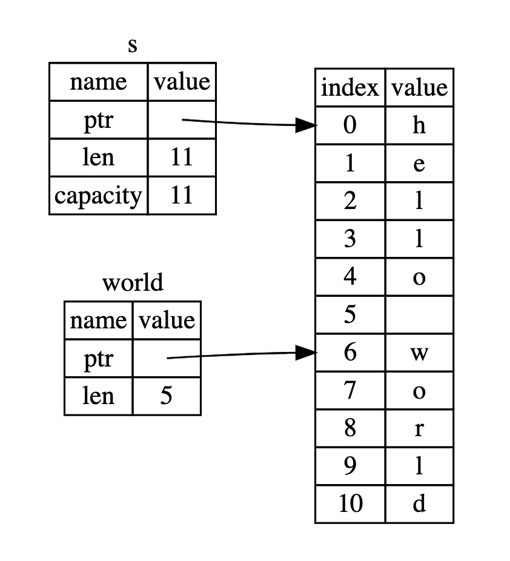

* 目录
{:toc}

# 切片类型

没有所有权的另一种数据类型是切片。切片使您可以引用集合中连续的元素序列，而不是整个集合。由此可见，切片与字符串String一样是一种独立的类型，且切片拥有多种不同类型（如：字符串切片）。

这是一个小的编程问题：编写一个函数，该函数需要一个字符串并返回在该字符串中找到的第一个单词。如果函数在字符串中找不到空格，则整个字符串必须是一个单词，因此应返回整个字符串。

让我们考虑一下此函数的签名：

```rust
fn first_word(s: &String) -> ?
```

此函数first_word具有＆String作为参数。我们不需要所有权。但是，我们应该返回什么呢？我们真的没有办法谈论字符串的一部分。但是，我们可以返回单词结尾的索引。

```rust
fn first_word(s: &String) -> usize {
    let bytes = s.as_bytes();

    for (i, &item) in bytes.iter().enumerate() {
        if item == b' ' {
            //将字节索引值返回
            return i;
        }
    }

    s.len()
}
```

因为我们需要逐个检查String元素，并检查值是否为空格，所以我们将使用as_bytes方法将String转换为字节数组：

```rust
let bytes = s.as_bytes();
```

接下来，我们使用iter方法在字节数组上创建一个迭代器：

```rust
for (i, &item) in bytes.iter().enumerate() {
```

iter是一种返回集合中每个元素的方法，该方法枚举（罗列）包装iter的结果并将每个元素作为元组的一部分返回。返回的元组的第一个元素是索引，第二个元素是对该元素的引用。这比自己计算索引要方便一些。

因为枚举方法返回一个元组，所以我们可以使用模式来提取该元组，就像Rust中的其他地方一样。因此，在for循环中，我们指定一个模式，该模式在元组中的索引中具有i，在元组中的单个字节中具有＆item。因为我们从.iter().enumerate()获得对元素的引用，所以在模式中使用＆。

在for循环内，我们使用字节文字语法搜索表示空格的字节。如果找到空格，则返回位置。否则，我们使用s.len()返回字符串的长度：

```rust
    if item == b' ' {
        return i;
    }
}

s.len()
```

现在，我们可以找到字符串中第一个单词结尾的索引，但这是有问题的。我们自己返回了一个usize，但是在＆String的上下文中，这只是一个有意义的数字。换句话说，由于它是与String分开的值，因此无法保证它将来仍然有效。

```rust
fn main() {
    let mut s = String::from("hello world");

    let word = first_word(&s); // 单词将获得值5

    s.clear(); // 这将清空字符串，使其等于""

    // word在这里仍然有值5，但是没有更多的字符串可以有意义地使用值5。这个词现在完全无效了！
}
```

该程序编译没有任何错误，如果我们在调用s.clear()之后使用word，也会这样。因为word根本没有连接到s的状态，所以word仍然包含值5。我们可以将值5与变量s一起使用以尝试提取第一个单词，但这将是一个错误，因为其中的内容自从我们保存了值5以来，s已经更改。（显然是因为后面调用了clear）

不必担心word中的索引与s中的数据不同步，这既繁琐又容易出错！如果我们编写second_word函数，则管理这些索引的难度更大。其签名必须如下所示：

```rust
fn second_word(s: &String) -> (usize, usize) {
```

现在，我们正在跟踪起始索引和结束索引，并且我们有更多的值是根据特定状态下的数据计算得出的，但与该状态完全无关。现在，我们有三个不相关的变量需要保持同步。

幸运的是，Rust解决了这个问题：字符串切片。

## String 切片

字符串切片是对字符串部分的引用，它看起来像这样：

```rust
let s = String::from("hello world");

let hello = &s[0..5];
let world = &s[6..11];
```

这类似于引用整个String，但具有额外的[0..5]位。它不是对整个String的引用，而是对String的一部分的引用。

通过指定[starting_index..ending_index]，我们可以使用方括号内的范围创建切片，其中，starting_index是切片中的第一个位置（类似数组为0）。在内部，切片数据结构存储切片的起始位置和长度，该长度对应于ending_index减去starting_index。因此，在let world = ＆s[6..11];的情况下，world将是一个切片，其中包含一个指向s的第7个字节的指针，其长度值为5。如下图



上图表示指代字符串一部分的字符串切片

使用Rust的..范围语法，如果您要从第一个索引（零）开始，则可以在两个句点之前删除该值。换句话说，这些是相等的：

```rust
let s = String::from("hello");

let slice = &s[0..2];
let slice = &s[..2];
```

同样，如果您的分片包含字符串的最后一个字节，则可以删除末尾数字。这意味着这些是相等的：

```rust
let s = String::from("hello");

let len = s.len();

let slice = &s[3..len];
let slice = &s[3..];
```

您也可以删除这两个值以截取整个字符串。所以这些是相等的：

```rust
let s = String::from("hello");

let len = s.len();

let slice = &s[0..len];
let slice = &s[..];
```

> 注意：字符串切片范围索引必须出现在有效的UTF-8字符边界处。如果尝试在多字节字符的中间创建字符串切片，则程序将退出并出现错误。同时，此处介绍的切片是对字符串常量（文字）而言的。不是字符串String（暂且称为对象/引用类型）

考虑到所有这些信息后，让我们重写first_word以返回切片。表示“字符串切片”的类型写为＆str：

```rust

fn first_word(s: &String) -> &str {
    let bytes = s.as_bytes();

    for (i, &item) in bytes.iter().enumerate() {
        if item == b' ' {
            return &s[0..i];//返回找到的字符串切片
        }
    }

    &s[..]
}
```

通过查找出现的第一个空格，可以获得单词结尾的索引。找到空格后，我们将以字符串的开头和空格的索引作为开始索引和结束索引来返回字符串切片。

现在，当我们调用first_word时，我们将获得与基础数据相关的单个值。该值由对切片起点的引用以及切片中元素的数量组成。

返回切片也可以用于second_word函数：

```rust
fn second_word(s: &String) -> &str {
```

现在，我们有了一个简单易用的API，因为编译器将确保对String的引用仍然有效，因此很难搞乱。还记得最开始程序中的错误吗？当我们将索引移到第一个单词的末尾但又清除了字符串使得我们的索引无效？该代码在逻辑上不正确，但没有立即显示任何错误。如果我们继续尝试将第一个单词索引与空字符串一起使用，问题将在稍后出现。切片使此错误变得不可能，并且让我们更早知道我们的代码有问题。使用first_word的切片版本将引发编译时错误：

```rust
fn main() {
    let mut s = String::from("hello world");

    let word = first_word(&s);

    s.clear(); // error!

    println!("the first word is: {}", word);
}
```

编译错误如下

```
error[E0502]: cannot borrow `s` as mutable because it is also borrowed as immutable
  --> src/main.rs:18:5
   |
16 |     let word = first_word(&s);
   |                           -- immutable borrow occurs here
17 |
18 |     s.clear(); // error!
   |     ^^^^^^^^^ mutable borrow occurs here
19 |
20 |     println!("the first word is: {}", word);
   |                                       ---- immutable borrow later used here
```

从借阅（即前面文章说的出借，借用）规则中回想起，如果我们对某物有不可变的引用，那么我们也不能采用可变的引用。由于clear需要截断String，因此需要获取可变的引用。 Rust不允许这样做，并且编译会失败。 Rust不仅使我们的API易于使用，而且还消除了编译时的一整类错误！

## 字符串文字是切片

回想一下，我们曾经讨论过将字符串文字存储在二进制文件中。现在我们了解了切片，我们可以正确理解字符串文字了：

```rust
let s = "Hello, world!";
```

s的类型是＆str：它是指向二进制文件的特定点的切片。这也是字符串文字不可变的原因。 因为很显然＆str是不可变的引用。

## 字符串切片作为参数

知道您可以采用文字和字符串值的切片，这使我们对first_word进行了另一项改进，那就是其签名：

```rust
fn first_word(s: &String) -> &str {
```

有经验的rust开发者会写成下面这样，它允许我们在＆String值和＆str值上使用相同的函数：

```rust
//通过使用字符串切片作为s参数的类型来改进first_word函数
fn first_word(s: &str) -> &str {
```

如果我们有一个字符串切片，我们可以直接传递它。如果我们有一个String，我们可以传递整个String的一部分。定义函数以采用字符串切片而不是对String的引用使我们的API更通用和有用，而不会丢失任何功能：

```rust
fn main() {
    let my_string = String::from("hello world");

    // first_word适用于`String`的切片
    let word = first_word(&my_string[..]);//将字符串转化为字符串切片

    let my_string_literal = "hello world";

    // first_word适用于字符串文字的切片（暂理解字符串文字是字符串常量，数据类型是&str，而String::from生成的是字符串对象/字符串类型的值，数据类型是String。）
    let word = first_word(&my_string_literal[..]);

    // 因为字符串文字已经是字符串切片，这也可以，没有切片语法！
    let word = first_word(my_string_literal);
}
```

## 其他切片

您可能会想到，字符串切片是特定于字符串的。但是，还有一种更通用的切片类型。考虑以下数组：

```rust
let a = [1, 2, 3, 4, 5];
```

就像我们可能要引用字符串的一部分一样，我们可能要引用数组的一部分。我们会这样做：

```rust
let a = [1, 2, 3, 4, 5];

let slice = &a[1..3];
```

该切片的类型为＆[i32]。它的工作方式与字符串切片相同,通过存储对第一个元素和长度的引用。您将在所有其他集合中使用这种切片。

## 总结

所有权，借用和切片的概念可确保在编译时Rust程序中的内存安全。 Rust语言与其他系统编程语言一样，使您可以控制内存使用情况，但是当数据所有者超出范围时，让数据所有者自动清除该数据意味着您不必编写和调试额外的代码得到这个控制。

所有权会影响Rust的其他许多部分，因此在本书的其余部分中，我们将进一步讨论这些概念。后面一些就是数据结构上的使用，不再翻译总结了。

[切片 原文 英文](https://doc.rust-lang.org/book/ch04-03-slices.html)

可能存在部分理解不到位或有问题的地方，仅供参考。